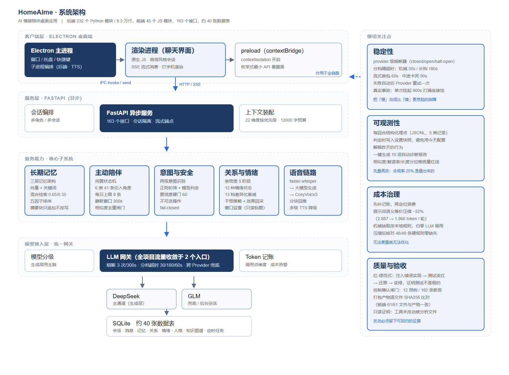
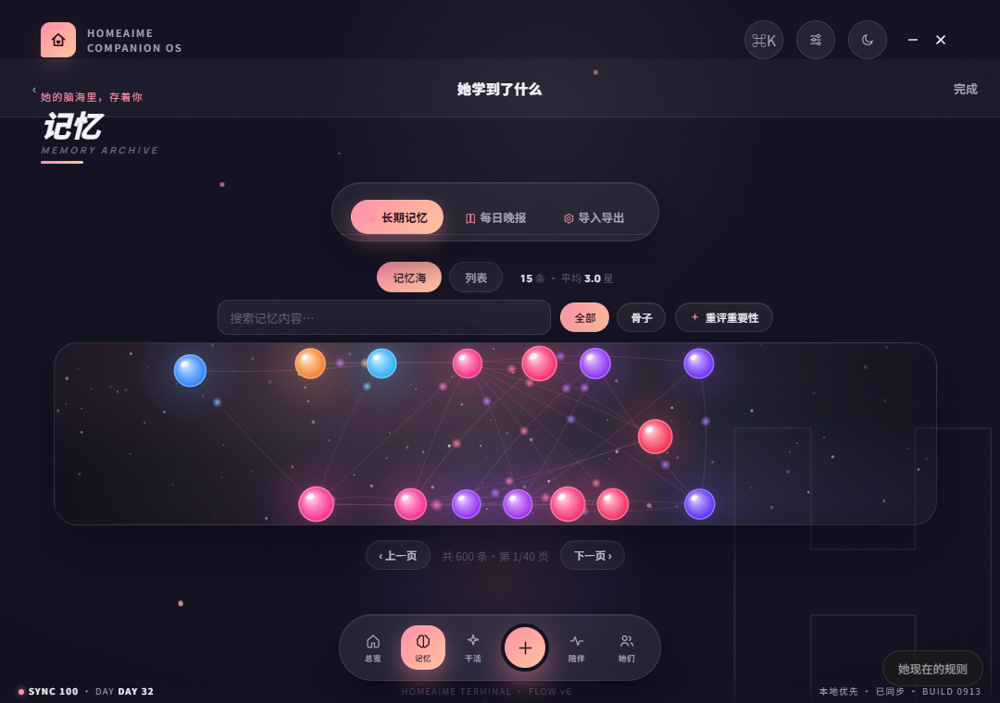
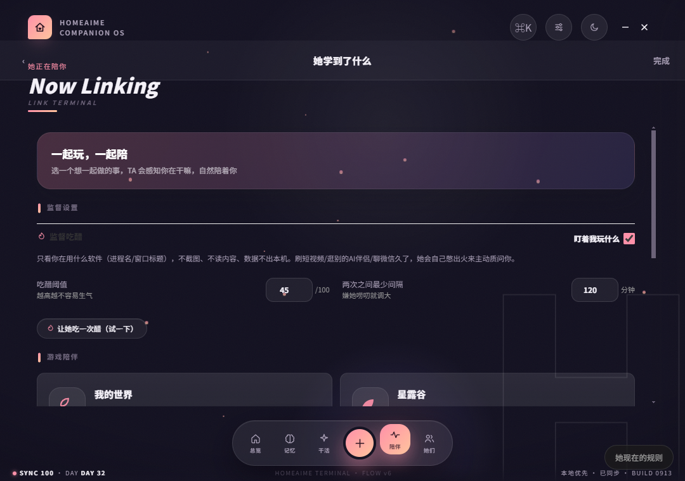
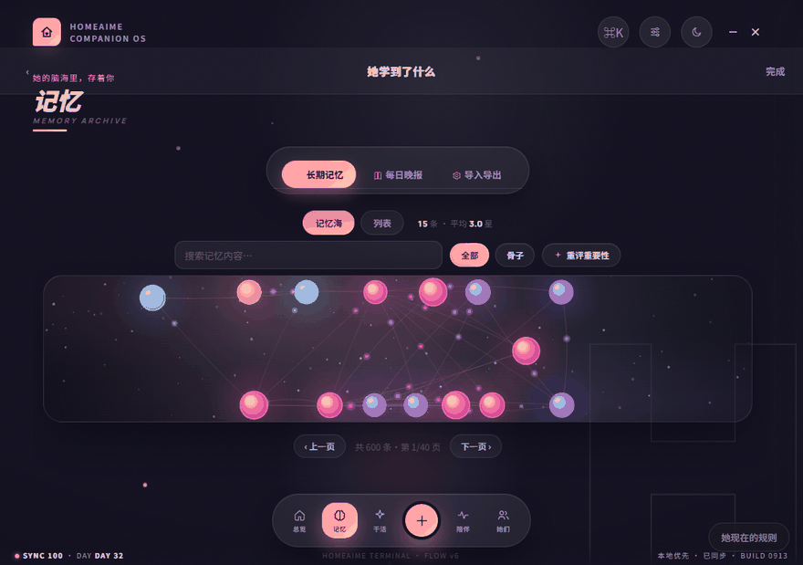

# HomeAime · AI 情感陪伴桌面应用

> 微信风格的 AI 陪伴桌面端：以 DeepSeek 为「大脑」，业务逻辑全部本地实现，目标是做出「有记忆、有情绪、会主动关心」的拟人化陪伴体验。
>
> **独立开发**：从产品设计、前后端开发到 Windows 安装包交付，全流程由作者一人完成。



---

## 这是什么

一个跑在自己电脑上的 AI 陪伴应用。它和「套壳聊天框」的区别在于，**状态是长期持有的**：

- 它**记得**你很久以前说过的事（三层记忆 + 摘要压缩，不是把历史全塞进上下文）
- 它**有自己的情绪和关系进度**（亲密度五阶段演化、12 种自身情绪状态，差异化衰减）
- 它**会主动找你**（闲置状态机 + 节奏闸门，而不是只被动回话）
- 它**能打电话**（本地语音识别 → 大模型生成 → 本地语音合成，分块回推）

规模：后端 **232 个 Python 模块 / 8.3 万行**，前端 **45 个 JS 模块 / 2.4 万行**，**163 个 HTTP / WebSocket 接口**，约 **40 张数据表**。

## 界面

**记忆档案**：把长期记忆做成可探索的语义网络。



**陪伴设置**：窗口监督（「吃醋」）功能的开关与参数。设计上**只读取前台窗口标题，不截图、不 OCR，数据不出本机**。





---

## 技术亮点

下面每一条都带真实参数，均可在源码中找到对应位置。

### 1. 长期记忆：三层架构 + 不可变摘要块

长对话有两个绕不过去的硬约束：**上下文窗口有限**，且**成本随轮次增长**（每轮都要重发历史）。所以压缩不是可选项。

- **三层记忆**：最近 **60 条**保留原文（眼前细节不丢）→ 攒够 **80 条**把更早的压成摘要块 → 日 / 周 / 月逐级递归压缩（**≤300 / ≤500 / ≤600 字**，压缩比逐级提高）
- **摘要块「只追加、永不改写」**：每块覆盖固定的消息区间，一旦生成不再改写。递归改写会把专有名词逐层洗掉，用 append-only 换「历史不被二次污染」
- **写入判重**：相似度 ≥ **0.72** 视为同一条，走「更新而非新增」，结果分 `duplicate / updated / inserted / skipped` 四态——`updated` 让记忆能演进，而不是留下两条互相矛盾的记录
- **硬预算截断**：system prompt 超过 **12,000 字**（约 8k token）就从最低优先级的上下文块往回丢，最少保留 3 块（优雅降级，不是报错）
- **作用域隔离**：记忆分 global / character / relationship 三域，默认落 character，**分类器异常时兜底也落 character**——宁可少共享，不可串到别的角色

### 2. 检索：向量 + 关键词混合，五因子排序

单靠向量检索会漏掉「精确关键词」型查询，单靠关键词又抓不住语义近似，所以两条通道都要。

- **混合检索权重**：向量 **0.65** / 关键词 **0.35**
- **五因子排序**：相关性 0.40 + 重要性 0.25 + 类型权重 0.15 + 新鲜度 0.10 + 衰减 0.10，最低得分门槛 **0.18**
- **记忆类型权重**：relationship / rule 1.00、emotion 0.95、event / episode 0.90、preference 0.85、fact 0.80、general 0.70
- **置信度温和降权**：`0.55 + 0.45 × confidence`，让「转述失真风险高」的记忆排到同类高置信记忆之后，而不是直接丢弃
- **向量补救**：向量通道独占命中且相似度 ≥ **0.6** 时补分

### 3. 稳定性：把「慢」当成比「错」更危险的故障

**真实事故**：上游大模型不报错也不返回，单次调用挂起 **900 秒**。连接池上限 **20 条**被挂住的请求占满，导致连完全健康的请求都发不出去——**一个外部依赖卡住，把整个服务拖死**。

修复分三层：

| 措施 | 参数 |
|---|---|
| provider 级熔断（closed / open / half-open） | 连续失败 **3** 次 → 熔断 **300 秒**，期间不发任何网络请求 |
| 分档硬超时 | 机械杂活 **30s** / 长档任务 **180s** / 流式首包 **60s** / 流式中途卡死 **90s** |
| 跨 Provider 兜底 | 主通道失败自动切备用模型重试一次 |

**为什么不能一刀切 30 秒**：日志实测存在**合法的慢调用**（反思类 56.62s / 28.07s、日总结 24.62s）。一刀切会把它们全部误杀，所以按任务类型分档。

**为什么用熔断而不是重试**：重试解决不了「对方卡住」，只会让更多请求一起卡在池子里。熔断是「先别再打了」，等冷却期过了再试探。

### 4. 成本治理：先建账，再优化

一开始流式主链路**完全没有 token 记账**——不知道钱花在哪，优化就无从谈起。补上计量与告警后，才逐项定位到结构性浪费：

| 优化项 | 效果 |
|---|---|
| 系统提示词语义等价压缩 | 每轮 **2,887 → 1,966 token（−32%）**，压缩后逐条核对 **48 / 48 条硬规则零缺失** |
| 语义分析器改本地规则 | 原本「每条消息一次 LLM 调用」（两天 271,931 输入 / 143,863 输出 token）→ **归零** |
| 删除重复的用户画像抽取 | 10 天 376 次自动提炼中**约半数是重复调用** |
| 承诺提取合并 | 每条气泡各跑一次（一轮 4 条气泡 = 5 次）→ **整轮 1 次** |

> 说明：提示词压缩模式默认关闭，需手动开启——它是「已实现的能力」，不是「一直在生效的优化」。

### 5. 主动陪伴：状态机 + 节奏闸门

「主动发言」最大的风险不是不发言，而是**打扰**。所以整条链路上都是闸门：

- **闲置状态机**：conversing → settling → waiting → ready；AI 说完最后一句后要过**静默窗口 300 秒**才开始计时
- **节奏上限**：每日「找话说」上限 **8 条**，间隔 **90–120 分钟**随机取值
- **切入角度**：6 类共 **41 条**候选（提问 / 提醒 / 续话 / 分享 / 关心 / 内心独白），随机抽取避免套路化
- **去重闸门**：与最近消息比相似度，超阈值静默丢弃
- **睡眠门禁**：用户说「去睡了 / 晚安」后 **6 小时内**闲聊类主动消息完全静默；用户发任意消息即视为醒来。这条门禁**必须落在代码里**——实测只靠 Prompt 约束，模型会无视
- **可归因**：每条主动消息的判定都落盘结构化日志，并记录**当时的设置快照**（间隔上下限、可用时段），避免「用今天的配置判断昨天的行为」

### 6. 安全闸门：代价不对称时，拿不准就不做

**真实缺陷**：控制确认（AI 可代用户执行关机等真实操作）原先用单字子串匹配，关键词里有「好 / 要 / 行」。实测 **8 条日常闲聊全部误判**——「好累啊」「好像有点吵」「好的我知道了」里都命中「好」，其中**「好累啊」会真实触发关机**。

修复：改为**模型四分类**（confirm / reject / ambiguous / unrelated）+ 正则仅作整句兜底 + **置信度 < 0.5 一律判 ambiguous、不执行**。

这里的关键判断是**代价不对称**：误判的代价是用户电脑被关机，漏判的代价只是用户再说一遍。所以必须 **fail-closed**。

### 7. 工程习惯：改动必须留下可回归的证据

- **红-绿验收**：先写用例让测试变红复现缺陷 → 改代码 → 变绿。并做**变异测试**：把正确实现换回旧实现，测试必须变红（不变红说明测试是假的）
- **打包产物逐文件 SHA256 比对**：确认「改的代码」真的进了用户跑的包（前端 61/61 文件一致）
- **结构化埋点**：每回合一行 JSONL（5 类记录），对主链路零阻塞；配套一键生成 **10 项自动诊断报告**，首跑即点名真实缺陷
- **量化优先**：主动消息间隔合规率**实测只有 25%**，是写脚本从真实数据逐条判定量出来的，不是猜的。有了这个基线，改完才能复测

---

## 架构

分层说明见上图。要点：

- **客户端**：Electron 主进程负责窗口与**子进程编排**（拉起后端与本地 TTS 服务）；渲染进程跑原生 JS 界面，经 **preload + contextBridge** 以枚举式最小 API 面与主进程通信（`contextIsolation` 开启、`nodeIntegration` 关闭）
- **服务层**：FastAPI 异步，163 个接口。所有 LLM 流量**收敛于两个入口函数**，因此熔断与降级可以在一处生效、覆盖全部 20 余个后台模块
- **业务能力**：长期记忆 / 主动陪伴 / 意图与安全 / 关系与情绪 / 语音链路，五块互相独立但共享状态
- **存储**：SQLite 约 40 张表（会话、消息、记忆、关系、情绪、人格、知识图谱、定时任务…）。状态类表用**唯一索引**保证「每会话一份」，流水类表用普通索引保证查询效率
- **另一种交付形态**：`server.js` 提供零依赖的本地 Web 版（复用同一套前端），手机连同一 Wi-Fi 即可访问

## 技术栈

**后端** Python 3.11 · FastAPI（异步） · SQLite · ChromaDB · sentence-transformers
**前端** 原生 JavaScript · HTML / CSS · Electron
**模型** DeepSeek + GLM（多 Provider，带熔断与自动降级）
**语音** faster-whisper（本地识别） · CosyVoice3（本地合成）
**交付** PyInstaller · electron-builder

## 快速开始

```bash
# 1) 依赖
pip install -r requirements.txt

# 2) 配置：复制模板并填入自己的 API Key
cp config.example.json config.json
#   必填 api_key（DeepSeek）；zhipu_api_key 用于主通道故障时兜底

# 3) 启动后端
python run.py

# 4) 启动桌面端
npm install
npm start
```

只想在浏览器里看界面（不需要 Electron）：`node server.js`，然后打开 `http://127.0.0.1:3000`。

> 本地语音链路（faster-whisper / CosyVoice3）会额外下载模型，首次启动较慢；只做文本对话可跳过语音相关依赖。

## 目录结构

```
backend/          后端：接口层、记忆、检索、情绪、关系、主动调度、可观测性、LLM 网关
public/           前端：原生 JS 界面（会话、记忆、关系、设置等模块）
electron-main.js  Electron 主进程：窗口管理 + 子进程编排
preload.js        渲染进程与主进程之间的最小 API 桥
server.js         零依赖本地 Web 版（同一套前端的另一种交付形态）
test/             测试
tools/            可观测性与诊断工具（埋点报告、质量分析、体检）
docs/             架构图与截图
```

## 已知限制与优化空间

写在这里是因为它们真实存在，且我知道怎么改：

- **SQLite 未开启 WAL 模式**（默认 rollback journal），写入会阻塞读取。单机单用户够用，但写入频繁时仍有优化余地
- **同步 SQLite 与异步框架混用**：数据库访问是阻塞式的，理想做法是丢进线程池（`run_in_executor`），避免极端情况下影响事件循环
- **部分后台调用尚未使用 prompt caching**：当前靠「模型分级 + 本地规则替代」降本，缓存命中折扣还没利用
- **未做多用户并发**：整个设计假定单机单用户，不是服务端架构
- **开发期产生的调试脚本与运行数据未纳入本仓库**（避免混入个人数据与密钥）

## License

MIT
